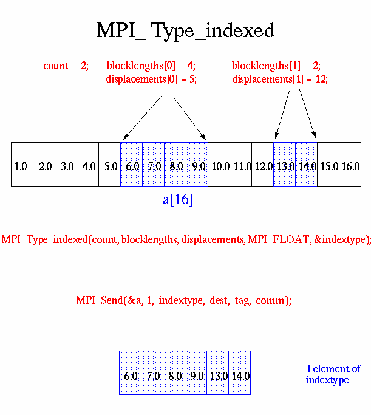

As [previously mentioned](routine_args.md), MPI predefines its primitive data types:

<table style="border-collapse:collapse;border-spacing:0" class="tg"><thead><tr><th style="background-color:#98ABCE;border-color:black;border-style:solid;border-width:1px;font-family:Arial, sans-serif;font-size:14px;font-weight:bold;overflow:hidden;padding:10px 5px;position:-webkit-sticky;position:sticky;text-align:center;top:-1px;vertical-align:middle;will-change:transform;word-break:normal" colspan="2"><span style="background-color:#98ABCE">C Data Types</span></th><th style="background-color:#98ABCE;border-color:black;border-style:solid;border-width:1px;font-family:Arial, sans-serif;font-size:14px;font-weight:bold;overflow:hidden;padding:10px 5px;position:-webkit-sticky;position:sticky;text-align:center;top:-1px;vertical-align:middle;will-change:transform;word-break:normal"><span style="background-color:#98ABCE">Fortran Data Types</span></th></tr></thead><tbody><tr><td style="border-color:black;border-style:solid;border-width:1px;font-family:Arial, sans-serif;font-size:14px;font-weight:bold;overflow:hidden;padding:10px 5px;text-align:left;vertical-align:top;word-break:normal"><span style="font-weight:bold">MPI_CHAR </span><br><span style="font-weight:bold">MPI_WCHAR </span><br><span style="font-weight:bold">MPI_SHORT </span><br><span style="font-weight:bold">MPI_INT </span><br><span style="font-weight:bold">MPI_LONG </span><br><span style="font-weight:bold">MPI_LONG_LONG_INT  </span><br><span style="font-weight:bold">MPI_LONG_LONG	 	  </span><br><span style="font-weight:bold">MPI_SIGNED_CHAR </span><br><span style="font-weight:bold">MPI_UNSIGNED_CHAR </span><br><span style="font-weight:bold">MPI_UNSIGNED_SHORT </span><br><span style="font-weight:bold">MPI_UNSIGNED_LONG</span><br><span style="font-weight:bold">MPI_UNSIGNED </span><br><span style="font-weight:bold">MPI_FLOAT </span><br><span style="font-weight:bold">MPI_DOUBLE</span><br><span style="font-weight:bold">MPI_LONG_DOUBLE </span></td><td style="border-color:black;border-style:solid;border-width:1px;font-family:Arial, sans-serif;font-size:14px;font-weight:bold;overflow:hidden;padding:10px 5px;text-align:left;vertical-align:top;word-break:normal"><span style="font-weight:bold">MPI_C_COMPLEX </span><br><span style="font-weight:bold">MPI_C_FLOAT_COMPLEX </span><br><span style="font-weight:bold">MPI_C_DOUBLE_COMPLEX </span><br><span style="font-weight:bold">MPI_C_LONG_DOUBLE_COMPLEX	 	  </span><br><span style="font-weight:bold">MPI_C_BOOL </span><br><span style="font-weight:bold">MPI_LOGICAL </span><br><span style="font-weight:bold">MPI_C_LONG_DOUBLE_COMPLEX 	 </span><br><span style="font-weight:bold">MPI_INT8_T  </span><br><span style="font-weight:bold">MPI_INT16_T </span><br><span style="font-weight:bold">MPI_INT32_T </span><br><span style="font-weight:bold">MPI_INT64_T	 	  </span><br><span style="font-weight:bold">MPI_UINT8_T  </span><br><span style="font-weight:bold">MPI_UINT16_T  </span><br><span style="font-weight:bold">MPI_UINT32_T  </span><br><span style="font-weight:bold">MPI_UINT64_T </span><br><span style="font-weight:bold">MPI_BYTE </span><br><span style="font-weight:bold">MPI_PACKED </span></td><td style="border-color:black;border-style:solid;border-width:1px;font-family:Arial, sans-serif;font-size:14px;font-weight:bold;overflow:hidden;padding:10px 5px;text-align:left;vertical-align:top;word-break:normal"><span style="font-weight:bold">MPI_CHARACTER </span><br><span style="font-weight:bold">MPI_INTEGER </span><br><span style="font-weight:bold">MPI_INTEGER1  </span><br><span style="font-weight:bold">MPI_INTEGER2 </span><br><span style="font-weight:bold">MPI_INTEGER4 </span><br><span style="font-weight:bold">MPI_REAL </span><br><span style="font-weight:bold">MPI_REAL2  </span><br><span style="font-weight:bold">MPI_REAL4 </span><br><span style="font-weight:bold">MPI_REAL8 </span><br><span style="font-weight:bold">MPI_DOUBLE_PRECISION </span><br><span style="font-weight:bold">MPI_COMPLEX </span><br><span style="font-weight:bold">MPI_DOUBLE_COMPLEX </span><br><span style="font-weight:bold">MPI_LOGICAL </span><br><span style="font-weight:bold">MPI_BYTE MPI_PACKED</span></td></tr></tbody></table>

MPI also provides facilities for you to define your own data structures based upon sequences of the MPI primitive data types. Such user defined structures are called derived data types.

Primitive data types are contiguous. Derived data types allow you to specify non-contiguous data in a convenient manner and to treat it as though it was contiguous.

MPI provides several methods for constructing derived data types:
* Contiguous
* Vector
* Indexed
* Struct

### Derived Data Type Routines

[**MPI_Type_contiguous**](derived_data_types/MPI_Type_contiguous.txt)

The simplest constructor. Produces a new data type by making count copies of an existing data type.

```
MPI_Type_contiguous (count,oldtype,&newtype)
MPI_TYPE_CONTIGUOUS (count,oldtype,newtype,ierr)
```

[**MPI_Type_vector**](derived_data_types/MPI_Type_vector.txt)

[**MPI_Type_hvector**](derived_data_types/MPI_Type_hvector.txt)

Similar to contiguous, but allows for regular gaps (stride) in the displacements. MPI_Type_hvector is identical to MPI_Type_vector except that stride is specified in bytes.

```
MPI_Type_vector (count,blocklength,stride,oldtype,&newtype)
MPI_TYPE_VECTOR (count,blocklength,stride,oldtype,newtype,ierr)
```

[**MPI_Type_indexed**](derived_data_types/MPI_Type_indexed.txt)

[**MPI_Type_hindexed**](derived_data_types/MPI_Type_hindexed.txt)

An array of displacements of the input data type is provided as the map for the new data type. MPI_Type_hindexed is identical to MPI_Type_indexed except that offsets are specified in bytes.

```
MPI_Type_indexed (count,blocklens[],offsets[],old_type,&newtype)
MPI_TYPE_INDEXED (count,blocklens(),offsets(),old_type,newtype,ierr)
```

[**MPI_Type_struct**](derived_data_types/MPI_Type_struct.txt)

The new data type is formed according to completely defined map of the component data types.

**NOTE**: This function is deprecated in MPI-2.0 and replaced by MPI_Type_create_struct in MPI-3.0

```
MPI_Type_struct (count,blocklens[],offsets[],old_types,&newtype)
MPI_TYPE_STRUCT (count,blocklens(),offsets(),old_types,newtype,ierr)
```

[**MPI_Type_extent**](derived_data_types/MPI_Type_extent.txt)

Returns the size in bytes of the specified data type. Useful for the MPI subroutines that require specification of offsets in bytes.

**NOTE**: This function is deprecated in MPI-2.0 and replaced by MPI_Type_get_extent in MPI-3.0

```
MPI_Type_extent (datatype,&extent)
MPI_TYPE_EXTENT (datatype,extent,ierr)
```

[**MPI_Type_commit**](derived_data_types/MPI_Type_commit.txt)

Commits new datatype to the system. Required for all user constructed (derived) datatypes.

```
MPI_Type_commit (&datatype)
MPI_TYPE_COMMIT (datatype,ierr)
```

[**MPI_Type_free**](derived_data_types/MPI_Type_free.txt)

Deallocates the specified datatype object. Use of this routine is especially important to prevent memory exhaustion if many datatype objects are created, as in a loop.

```
MPI_Type_free (&datatype)
MPI_TYPE_FREE (datatype,ierr)
```

### Examples

#### Examples: Contiguous Derived Data Type

Create a data type representing a row of an array and distribute a different row to all processes.


C and Fortran code examples [here](derived_data_types/contiguous_examples.md).

#### Examples: Vector Derived Data Type

Create a data type representing a column of an array and distribute different columns to all processes.


C and Fortran code examples [here](derived_data_types/vector_examples.md).

#### Examples: Indexed Derived Data Type

Create a datatype by extracting variable portions of an array and distribute to all tasks.



C and Fortran code examples [here](derived_data_types/indexed_examples.md).

#### Examples: Struct Derived Data Type

Create a data type that represents a particle and distribute an array of such particles to all processes.


C and Fortran code examples [here](derived_data_types/struct_examples.md).
