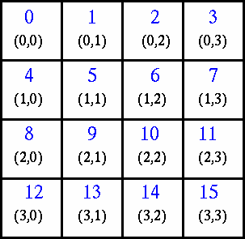

### What Are They?

In terms of MPI, a virtual topology describes a mapping/ordering of MPI processes into a geometric "shape".

The two main types of topologies supported by MPI are Cartesian (grid) and Graph.

MPI topologies are virtual - there may be no relation between the physical structure of the parallel machine and the process topology.

Virtual topologies are built upon MPI communicators and groups.

They must be "programmed" by the application developer.

### Why Use Them?

**Convenience**

Virtual topologies may be useful for applications with specific communication patterns - patterns that match an MPI topology structure. For example, a Cartesian topology might prove convenient for an application that requires 4-way nearest neighbor communications for grid based data.

**Communication Efficiency**

Some hardware architectures may impose penalties for communications between successively distant "nodes".

A particular implementation may optimize process mapping based upon the physical characteristics of a given parallel machine.

The mapping of processes into an MPI virtual topology is dependent upon the MPI implementation, and may be totally ignored.

### Example:

A simplified mapping of processes into a Cartesian virtual topology appears below:



### Code examples

Create a 4 x 4 Cartesian topology from 16 processors and have each process exchange its rank with four neighbors.

#### C Language - Cartesian Virtual Topology Example

```
#include "mpi.h"
#include <stdio.h>
#define SIZE 16
#define UP    0
#define DOWN  1
#define LEFT  2
#define RIGHT 3

main(int argc, char *argv[])  {
int numtasks, rank, source, dest, outbuf, i, tag=1,
    inbuf[4]={MPI_PROC_NULL,MPI_PROC_NULL,MPI_PROC_NULL,MPI_PROC_NULL,},
    nbrs[4], dims[2]={4,4},
    periods[2]={0,0}, reorder=0, coords[2];

MPI_Request reqs[8];
MPI_Status stats[8];
MPI_Comm cartcomm;   // required variable

MPI_Init(&argc,&argv);
MPI_Comm_size(MPI_COMM_WORLD, &numtasks);

if (numtasks == SIZE) {
    // create cartesian virtual topology, get rank, coordinates, neighbor ranks
    MPI_Cart_create(MPI_COMM_WORLD, 2, dims, periods, reorder, &cartcomm);
    MPI_Comm_rank(cartcomm, &rank);
    MPI_Cart_coords(cartcomm, rank, 2, coords);
    MPI_Cart_shift(cartcomm, 0, 1, &nbrs[UP], &nbrs[DOWN]);
    MPI_Cart_shift(cartcomm, 1, 1, &nbrs[LEFT], &nbrs[RIGHT]);

    printf("rank= %d coords= %d %d  neighbors(u,d,l,r)= %d %d %d %d\n",
            rank,coords[0],coords[1],nbrs[UP],nbrs[DOWN],nbrs[LEFT],
            nbrs[RIGHT]);

    outbuf = rank;

    // exchange data (rank) with 4 neighbors
    for (i=0; i<4; i++) {
        dest = nbrs[i];
        source = nbrs[i];
        MPI_Isend(&outbuf, 1, MPI_INT, dest, tag,
                MPI_COMM_WORLD, &reqs[i]);
        MPI_Irecv(&inbuf[i], 1, MPI_INT, source, tag,
                MPI_COMM_WORLD, &reqs[i+4]);
        }

    MPI_Waitall(8, reqs, stats);

    printf("rank= %d                  inbuf(u,d,l,r)= %d %d %d %d\n",
            rank,inbuf[UP],inbuf[DOWN],inbuf[LEFT],inbuf[RIGHT]);  }
else
    printf("Must specify %d processors. Terminating.\n",SIZE);

MPI_Finalize();
}
```

#### Fortran - Cartesian Virtual Topology Example

```
program cartesian
include 'mpif.h'

integer SIZE, UP, DOWN, LEFT, RIGHT
parameter(SIZE=16)
parameter(UP=1)
parameter(DOWN=2)
parameter(LEFT=3)
parameter(RIGHT=4)
integer numtasks, rank, source, dest, outbuf, i, tag, ierr, &
        inbuf(4), nbrs(4), dims(2), coords(2), periods(2), reorder
integer stats(MPI_STATUS_SIZE, 8), reqs(8)
integer cartcomm   ! required variable
data inbuf /MPI_PROC_NULL,MPI_PROC_NULL,MPI_PROC_NULL,MPI_PROC_NULL/, &
    dims /4,4/, tag /1/, periods /0,0/, reorder /0/

call MPI_INIT(ierr)
call MPI_COMM_SIZE(MPI_COMM_WORLD, numtasks, ierr)

if (numtasks .eq. SIZE) then
    ! create cartesian virtual topology, get rank, coordinates, neighbor ranks
    call MPI_CART_CREATE(MPI_COMM_WORLD, 2, dims, periods, reorder, &
                        cartcomm, ierr)
    call MPI_COMM_RANK(cartcomm, rank, ierr)
    call MPI_CART_COORDS(cartcomm, rank, 2, coords, ierr)
    call MPI_CART_SHIFT(cartcomm, 0, 1, nbrs(UP), nbrs(DOWN), ierr)
    call MPI_CART_SHIFT(cartcomm, 1, 1, nbrs(LEFT), nbrs(RIGHT), ierr)

    write(*,20) rank,coords(1),coords(2),nbrs(UP),nbrs(DOWN), &
                nbrs(LEFT),nbrs(RIGHT)

    ! exchange data (rank) with 4 neighbors
    outbuf = rank
    do i=1,4
        dest = nbrs(i)
        source = nbrs(i)
        call MPI_ISEND(outbuf, 1, MPI_INTEGER, dest, tag, &
                    MPI_COMM_WORLD, reqs(i), ierr)
        call MPI_IRECV(inbuf(i), 1, MPI_INTEGER, source, tag, &
                    MPI_COMM_WORLD, reqs(i+4), ierr)
    enddo

    call MPI_WAITALL(8, reqs, stats, ierr)

    write(*,30) rank,inbuf

else
    print *, 'Must specify',SIZE,' processors.  Terminating.'
endif

call MPI_FINALIZE(ierr)

20 format('rank= ',I3,' coords= ',I2,I2, &
            ' neighbors(u,d,l,r)= ',I3,I3,I3,I3 )
30 format('rank= ',I3,'                 ', &
            ' inbuf(u,d,l,r)= ',I3,I3,I3,I3 )

end
```

Sample program output: (partial)

```
rank=   0 coords=  0 0 neighbors(u,d,l,r)=  -1  4 -1  1
rank=   0                  inbuf(u,d,l,r)=  -1  4 -1  1
rank=   8 coords=  2 0 neighbors(u,d,l,r)=   4 12 -1  9
rank=   8                  inbuf(u,d,l,r)=   4 12 -1  9
rank=   1 coords=  0 1 neighbors(u,d,l,r)=  -1  5  0  2
rank=   1                  inbuf(u,d,l,r)=  -1  5  0  2
rank=  13 coords=  3 1 neighbors(u,d,l,r)=   9 -1 12 14
rank=  13                  inbuf(u,d,l,r)=   9 -1 12 14
...
...
rank=   3 coords=  0 3 neighbors(u,d,l,r)=  -1  7  2 -1
rank=   3                  inbuf(u,d,l,r)=  -1  7  2 -1
rank=  11 coords=  2 3 neighbors(u,d,l,r)=   7 15 10 -1
rank=  11                  inbuf(u,d,l,r)=   7 15 10 -1
rank=  10 coords=  2 2 neighbors(u,d,l,r)=   6 14  9 11
rank=  10                  inbuf(u,d,l,r)=   6 14  9 11
rank=   9 coords=  2 1 neighbors(u,d,l,r)=   5 13  8 10
rank=   9                  inbuf(u,d,l,r)=   5 13  8 10
```
