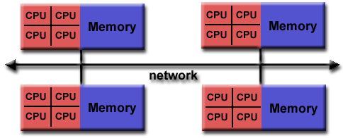

## An Interface Specification

**M P I** = **M**essage **P**assing **I**nterface

MPI is a specification for the developers and users of message passing libraries. 

MPI  *addresses the message-passing parallel programming model*: data is moved from the address space of one process to that of another process through cooperative operations on each process.

The goal of the Message Passing Interface is to provide a widely used standard for writing message passing programs. The interface attempts to be:

- Practical
- Portable
- Efficient
- Flexible

The MPI standard has gone through a number of revisions, with the most recent version being MPI-5.0 (This tutorial will be focused on MPI 4.2, the version widely available on LC systems)

Interface specifications have been defined for C and Fortran90 language bindings:

- C++ bindings from MPI-1 are removed in MPI-3
- MPI-3 also provides support for Fortran 2003 and 2008 features

Actual MPI library implementations differ in which version and features of the MPI standard they support. Developers/users will need to be aware of this.

## Programming Model

Originally, MPI was designed for distributed memory architectures, which were becoming increasingly popular at that time (1980s - early 1990s).

As architecture trends changed, shared memory SMPs were combined over networks creating hybrid distributed memory / shared memory systems.

MPI implementors adapted their libraries to handle both types of underlying memory architectures seamlessly. They also adapted/developed ways of handling different interconnects and protocols.

Today, MPI runs on virtually any hardware platform:

- Distributed Memory
- Shared Memory
- Hybrid

The programming model *clearly remains a distributed memory model* however, regardless of the underlying physical architecture of the machine.

All parallelism is explicit: the programmer is responsible for correctly identifying parallelism and implementing parallel algorithms using MPI constructs.

## Reasons for Using MPI

- **Standardization** - MPI is the only message passing library that can be considered "standard" for HPC. It is supported on virtually all HPC platforms. 
- **Portability** - There should be little or no need to modify your source code when you port your application to a different platform that supports (and is compliant with) the MPI standard.
- **Performance Opportunities** - Vendor implementations should be able to exploit native hardware features to optimize performance for venodr-specific hardware, such as interconnects, RMA, etc. Any implementation is free to develop optimized algorithms.
- **Functionality** - There are over 430 routines defined in MPI-4.
    - NOTE: Most MPI programs can be written using a dozen or less routines
- **Availability** - A variety of implementations are available, both vendor and public domain.

## History and Evolution: (for those interested)

MPI has resulted from the efforts of numerous individuals and groups that began in 1992. Some history:

- **1980s - early 1990s**: Distributed memory, parallel computing develops, as do a number of incompatible software tools for writing such programs - usually with tradeoffs between portability, performance, functionality and price. Recognition of the need for a standard arose.
- **Apr 1992**: Workshop on Standards for Message Passing in a Distributed Memory Environment, sponsored by the Center for Research on Parallel Computing, Williamsburg, Virginia. The basic features essential to a standard message passing interface were discussed, and a working group established to continue the standardization process. Preliminary draft proposal developed subsequently.
- **Nov 1992**: Working group meets in Minneapolis. MPI draft proposal (MPI1) from ORNL presented. Group adopts procedures and organization to form the [MPI Forum](https://computing.llnl.gov/tutorials/mpi/mpi.forum.html). It eventually comprised of about 175 individuals from 40 organizations including parallel computer vendors, software writers, academia and application scientists.
- **Nov 1993**: Supercomputing 93 conference - draft MPI standard presented.
- **May 1994**: Final version of MPI-1.0 released
    - MPI-1.1 (Jun 1995)
    - MPI-1.2 (Jul 1997)
    - MPI-1.3 (May 2008).
- **1998**: MPI-2 picked up where the first MPI specification left off, and addressed topics which went far beyond the MPI-1 specification.
    - MPI-2.1 (Sep 2008)
    - MPI-2.2 (Sep 2009)
- **Sep 2012**: The MPI-3.0 standard was approved.
    - MPI-3.1 (Jun 2015)
- **Sep 2023**: The MPI-4.0 standard was approved.
    - MPI-4.1 (Nov 2023)
- **Current**: The MPI-5.0 standard is under development.

## Documentation

Documentation for all versions of the MPI standard is available at: [http://www.mpi-forum.org/docs/](http://www.mpi-forum.org/docs/)
