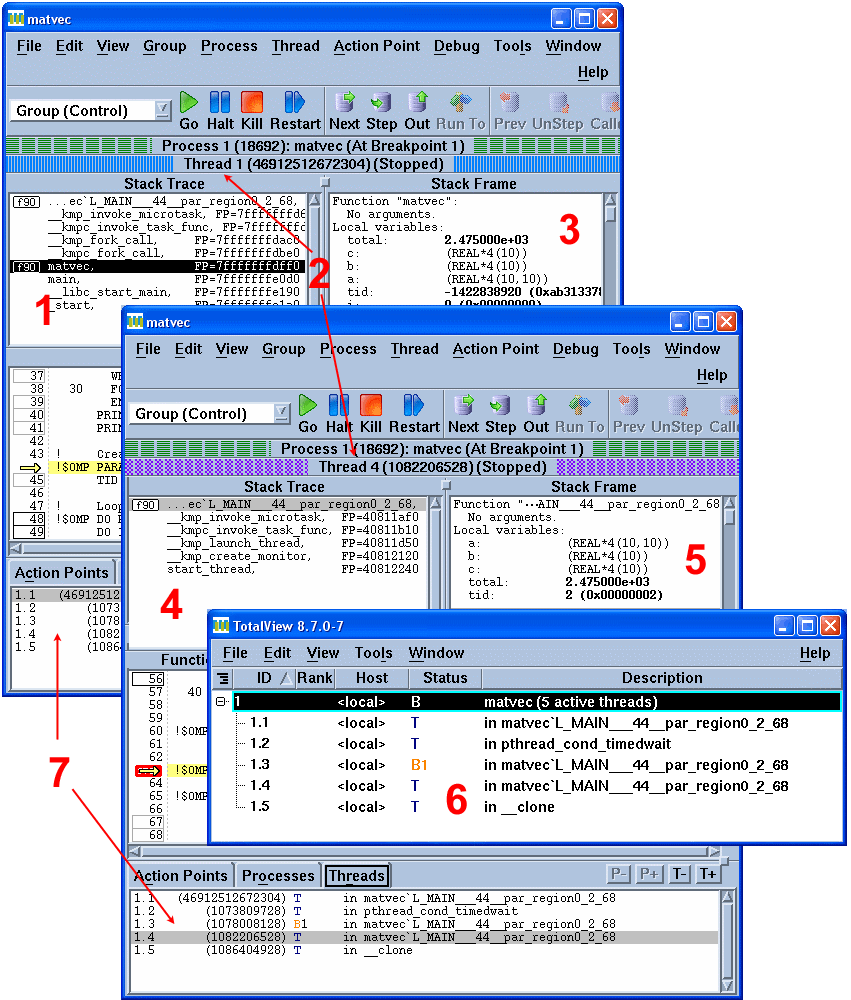

## Monitoring and Debugging Threads:

* Debuggers vary in their ability to handle threads. The TotalView debugger is LC's recommended debugger for parallel programs. It is well suited for both monitoring and debugging threaded programs.

* An example screenshot from a TotalView session using an OpenMP code is shown below.
  1. Master thread Stack Trace Pane showing original routine
  2. Process/thread status bars differentiating threads
  3. Master thread Stack Frame Pane showing shared variables
  4. Worker thread Stack Trace Pane showing outlined routine.
  5. Worker thread Stack Frame Pane
  6. Root Window showing all threads
  7. Threads Pane showing all threads plus selected thread

* See the [TotalView Debugger tutorial](https://hpc.llnl.gov/training/tutorials/totalview-tutorial) for details.

* The Linux `ps` command provides several flags for viewing thread information. Some examples are shown below. See the [man page](https://www.freebsd.org/cgi/man.cgi?query=ps&manpath=FreeBSD+13.0-RELEASE+and+Ports) for details.

<pre>
% <b>ps -Lf </b>
UID        PID  PPID   LWP  C NLWP STIME TTY          TIME CMD
blaise   22529 28240 22529  0    5 11:31 pts/53   00:00:00 a.out
blaise   22529 28240 22530 99    5 11:31 pts/53   00:01:24 a.out
blaise   22529 28240 22531 99    5 11:31 pts/53   00:01:24 a.out
blaise   22529 28240 22532 99    5 11:31 pts/53   00:01:24 a.out
blaise   22529 28240 22533 99    5 11:31 pts/53   00:01:24 a.out

% <b>ps -T </b>
  PID  SPID TTY          TIME CMD
22529 22529 pts/53   00:00:00 a.out
22529 22530 pts/53   00:01:49 a.out
22529 22531 pts/53   00:01:49 a.out
22529 22532 pts/53   00:01:49 a.out
22529 22533 pts/53   00:01:49 a.out

% <b>ps -Lm</b> 
  PID   LWP TTY          TIME CMD
22529     - pts/53   00:18:56 a.out
    - 22529 -        00:00:00 -
    - 22530 -        00:04:44 -
    - 22531 -        00:04:44 -
    - 22532 -        00:04:44 -
    - 22533 -        00:04:44 -
</pre>

