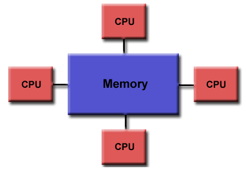
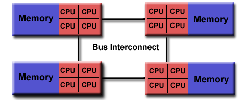
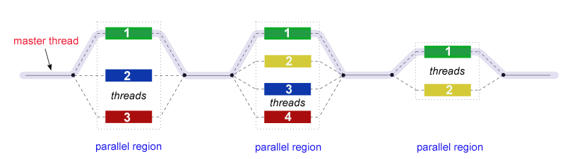
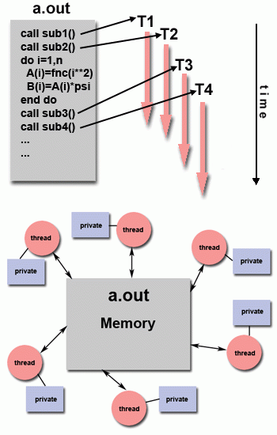

## Openmp has - Memory Model, Execution Model:
## Shared Memory Model:

OpenMP is designed for multi-processor/core, shared memory machines. The underlying architecture can be shared memory UMA or NUMA. 

 
## Openmp Execution  Model:
## Thread Based Parallelism:

OpenMP programs accomplish parallelism exclusively through the use of threads.

A thread of execution is the smallest unit of processing that can be scheduled by an operating system. The idea of a subroutine that can be scheduled to run autonomously might help explain what a thread is.

Threads exist within the resources of a single process. Without the process, they cease to exist.

Typically, the number of threads match the number of machine processors/cores. However, the actual use of threads is up to the application. 

## Explicit Parallelism:

OpenMP is an explicit (not automatic) programming model, offering the programmer full control over parallelization.

Parallelization can be as simple as taking a serial program and inserting compiler directives....

Or as complex as inserting subroutines to set multiple levels of parallelism, locks and even nested locks. 

## Fork - Join Model:

OpenMP uses the fork-join model of parallel execution: 

All OpenMP programs begin as a single process: the **master thread**. The master thread executes sequentially until the first **parallel region** construct is encountered.

**FORK**: the master thread then creates a team of parallel *threads*.

The statements in the program that are enclosed by the parallel region construct are then executed in parallel among the various team threads.

**JOIN**: When the team threads complete the statements in the parallel region construct, they synchronize and terminate, leaving only the master thread.

The number of parallel regions and the threads that comprise them are arbitrary. 

## Compiler Directive Based:

Most OpenMP parallelism is specified through the use of compiler directives which are imbedded in C/C++ or Fortran source code. 

## Nested Parallelism:

The API provides for the placement of parallel regions inside other parallel regions.

Implementations may or may not support this feature. 

## Dynamic Threads:

The API provides for the runtime environment to dynamically alter the number of threads used to execute parallel regions. Intended to promote more efficient use of resources, if possible.

Implementations may or may not support this feature. 

## I/O:

OpenMP specifies nothing about parallel I/O.

It is entirely up to the programmer to ensure that I/O is conducted correctly within the context of a multi-threaded program. 

## Execution Model and Memory Model Interactions: 

Single-Program-Multiple-Data (SPMD) is underlying programming paradigm - all threads have potential to  execute the same program code, however, each thread may access modify different data and traverse different execution paths.

OpenMP provides a "relaxed-consistency" and "temporary" view of thread memory - threads have equal access to shared memory where variables can be retrieved/stored. Each thread also has its own temporary copies of variables that may be modified independent from variables in memory.

When it is critical that all threads have a consistent view of a shared variable, the programmer (or compiler) is responsible for insuring that the variable is updated by all threads as needed, via an explict action - ie., FLUSH, or implicitly (via compiler recognition of program flow leaving a parallel regions).

## OpenMP Programming:

* Method to start up paralell threads
* Method to discover how many threads are running
* Need way to uniquely identify threads
* Method to join threads for serial execution
* Method to synchronize threads
* Ensure consistent view of data items when necesasry
* Required to check for data dependencies, data conflicts, race conditions, or deadlocks

