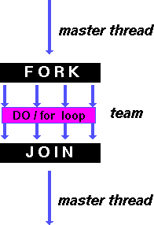
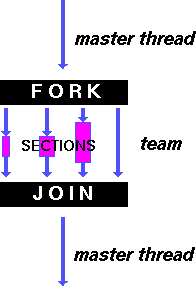

A work-sharing construct divides the execution of the enclosed code region among the members of the team that encounter it.

Work-sharing constructs do not launch new threads

There is no implied barrier upon entry to a work-sharing construct, however there is an implied barrier at the end of a work sharing construct.

## Types of Work-Sharing Constructs:

*NOTE: The Fortran **workshare** construct is not shown here, but is discussed later.*

### DO / for

**DO / for** shares iterations of a loop across the team. Represents a type of "data parallelism".	

### SECTIONS

**SECTIONS** breaks work into separate, discrete sections. Each section is executed by a thread. Can be used to implement a type of "functional parallelism".	

### SINGLE

**SINGLE** serializes a section of code

## Restrictions:

A work-sharing construct must be enclosed dynamically within a parallel region in order for the directive to execute in parallel.

Work-sharing constructs must be encountered by all members of a team or none at all.

Successive work-sharing constructs must be encountered in the same order by all members of a team.