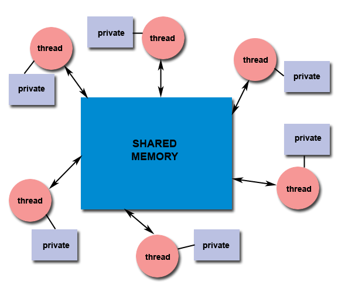
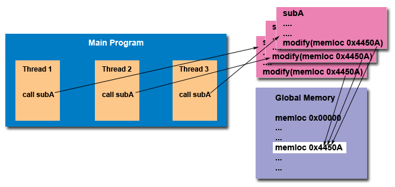

## Pthreads Overview: Designing Threaded Programs

### Parallel Programming

On modern, multi-core machines, pthreads are ideally suited for parallel programming, and whatever applies to parallel programming in general, applies to parallel pthreads programs.

There are many considerations for designing parallel programs, such as:

* Parallel programming model
* Problem partitioning
* Load balancing
* Communications
* Data dependencies
* Synchronization and race conditions
* Memory issues
* I/O issues
* Program complexity
* Programmer effort/costs/time

Covering these topics is beyond the scope of this tutorial, however interested readers can obtain a quick overview in the [Introduction to Parallel Computing](https://hpc.llnl.gov/training/tutorials/introduction-parallel-computing-tutorial) tutorial.

In general though, in order for a program to take advantage of Pthreads, it must be able to be organized into discrete, independent tasks which can execute concurrently. For example, if two routines can be interchanged, interleaved and/or overlapped in real time, they are candidates for threading.

Programs having the following characteristics may be well suited for pthreads:

* Block for potentially long I/O waits
* Use many CPU cycles in some places but not others
* Must respond to asynchronous events
* Some work is more important than other work (priority interrupts)

Several common models for threaded programs exist:

* **Manager/worker**: a single-threaded manager assigns work to other threads, the workers. Typically, the manager handles all input and parcels out work to the other tasks. At least two forms of the manager/worker model are common: static worker pool and dynamic worker pool.
* **Pipeline**: a task is broken into a series of suboperations, each of which is handled in sequence, but concurrently, by a different thread. An automobile assembly line best describes this model.
* **Peer**: similar to the manager/worker model, but after the main thread creates other threads, it participates in the work.

### Shared Memory Model

All threads have access to the same global, shared memory, but threads also have their own private data. Programmers are responsible for synchronizing (and protecting) access to globally shared data.

### Thread-safeness

Thread-safeness, in a nutshell, refers to an application's ability to execute multiple threads simultaneously without "clobbering" shared data or creating race conditions.

For example, suppose that your application creates several threads, each of which makes a call to the same library routine:

* This library routine accesses/modifies a global structure or location in memory.
* As each thread calls this routine it is possible that they may try to modify this global structure/memory location at the same time.
* If the routine does not employ some sort of synchronization constructs to prevent data corruption, then it is not thread-safe.

The implication to users of external library routines is that if you aren't 100% certain the routine is thread-safe, then you take your chances with problems that could arise.

Recommendation: Be careful if your application uses libraries or other objects that don't explicitly guarantee thread-safeness. When in doubt, assume that they are not thread-safe until proven otherwise. This can be done by "serializing" the calls to the uncertain routine, etc.

### Thread Limits

Although the Pthreads API is an ANSI/IEEE standard, implementations can, and usually do, vary in ways not specified by the standard. Because of this, a program that runs fine on one platform, may fail or produce wrong results on another platform. For example, the maximum number of threads permitted, and the default thread stack size are two important limits to consider when designing your program.

Several thread limits are discussed in more detail later in this tutorial.
