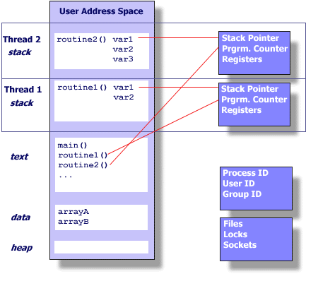

## Pthreads Overview: What is a Thread?

Technically, a thread is defined as an independent stream of instructions that can be scheduled to run as such by the operating system. But what does this mean?

To the software developer, the concept of a "procedure" that runs independently from its main program may best describe a thread.

To go one step further, imagine a program that contains a number of procedures. Then imagine all of these procedures being able to be scheduled to run simultaneously and/or independently by the operating system. That would describe a "multi-threaded" program.

How is this accomplished?

Before understanding a thread, one first needs to understand a UNIX process. A process is created by the operating system, and requires a fair amount of "overhead". Processes contain information about program resources and program execution state, including:

* Identifying information (e.g. process ID and user ID)
* Environment variables
* Working directory
* Program instructions
* CPU state (e.g. registers, fault info)
* Memory allocation (stack and heap)
* File descriptors
* Signal actions
* Shared libraries
* Inter-process communication related information (such as message queues, pipes, semaphores, or shared memory).

**Unix process**

**Threads within a unix process**

Threads use and exist within these process resources, yet are able to be scheduled by the operating system and run as independent entities. To accomplish this, threads only hold the bare essential resources that enable them to exist as executable code, such as:
* Stack pointer
* Registers
* Scheduling properties (such as policy or priority)
* Set of pending and blocked signals
* Thread-specific data

So, in summary, in the UNIX environment a thread:
* Exists within a process and uses the process resources
* Has its own independent control flow as long as its parent process exists and the OS supports it
* Duplicates only the essential resources it needs to be independently schedulable, making it lightweight
* May share the process resources with other threads

Because threads within the same process share resources:
* Changes made by one thread to shared system resources (such as closing a file) will be seen by all other threads
* Two pointers having the same value point to the same data
* Reading and writing to the same memory locations is possible, and therefore requires explicit synchronization by the programmer
