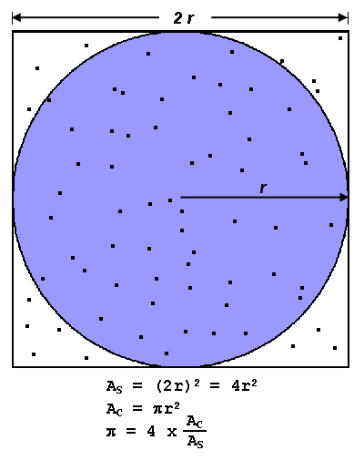
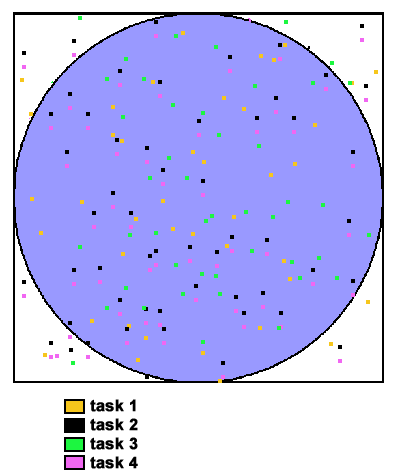

#### First, a Simple Example:

The value of PI can be calculated in various ways. Consider the Monte Carlo method of approximating PI:

* Inscribe a circle with radius r in a square with side length of 2r
* The area of the circle is <MATH>Πr^2</MATH> and the area of the square is <MATH>4r^2</MATH>
* The ratio of the area of the circle to the area of the square is: 
<MATH>Πr^2 / 4r^2 = Π / 4</MATH>
* If you randomly generate $N$ points inside the square, approximately 
$N * Π / 4$ of those points ($M$) should fall inside the circle.
* Π is then approximated as: 
$N * Π / 4 = M$
$Π / 4 = M / N$
$Π = 4 * M / N$

Note that increasing the number of points generated improves the approximation.



Serial pseudo code for this procedure

```

npoints = 10000
circle_count = 0

do j = 1,npoints
  generate 2 random numbers between 0 and 1
  xcoordinate = random1
  ycoordinate = random2
  if (xcoordinate, ycoordinate) inside circle
  then circle_count = circle_count + 1
end do

PI = 4.0*circle_count/npoints
```

leads to an "embarrassingly parallel" solution:
* It breaks the loop iterations into chunks that can be executed by different tasks simultaneously.
* Each task executes its portion of the loop a number of times.
* Each task can do its work without requiring any information from the other tasks (there are no data dependencies).
* Master task receives results from other tasks **using send/receive point-to-point operations**.

Pseudo code solution: **bold** highlights changes for parallelism.
<pre>
npoints = 10000
circle_count = 0

<b>p = number of tasks</b>
<b>num = npoints/p</b>

<b>find out if I am MASTER or WORKER</b>

do j = 1,<b>num</b> 
  generate 2 random numbers between 0 and 1
  xcoordinate = random1
  ycoordinate = random2
  if (xcoordinate, ycoordinate) inside circle
  then circle_count = circle_count + 1
end do

<b>
if I am MASTER
  receive from WORKERS their circle_counts
  compute PI (use MASTER and WORKER calculations)
else if I am WORKER
  send to MASTER circle_count
endif
</b>
</pre>

***Key Concept**: Divide work between available tasks which communicate data via point-to-point message passing calls.*



